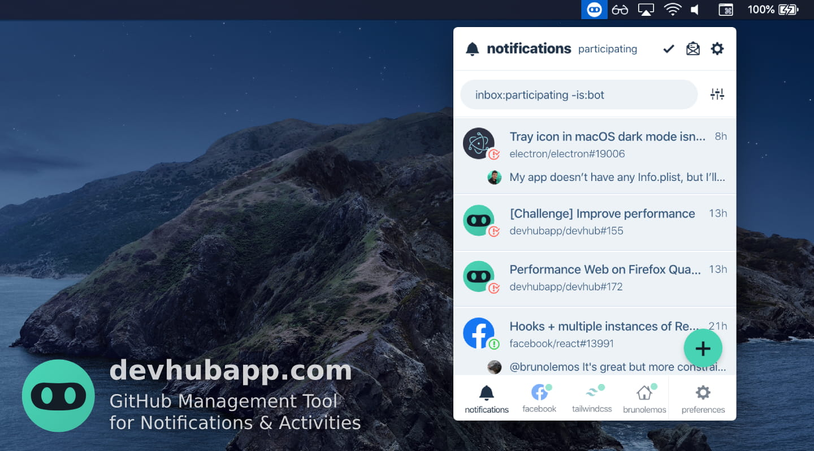
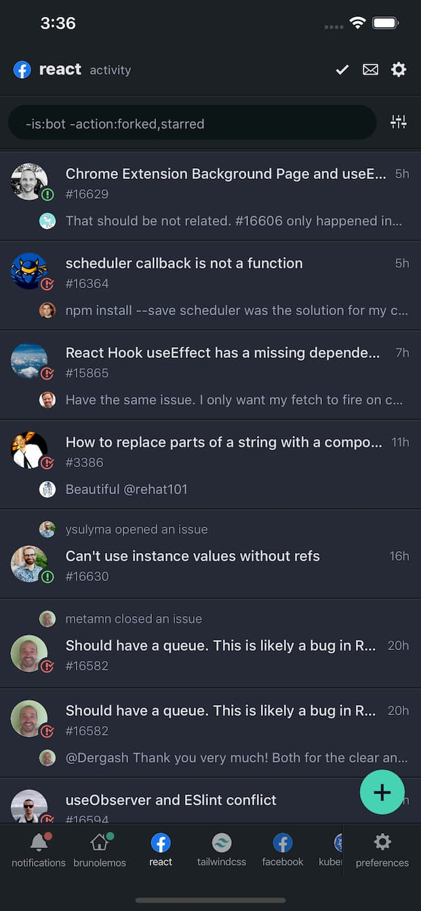

<p align="center">
  <br/>
  <span><b>DevHub</b>: <span>GitHub Notifications & Activities on your Desktop</span><br/>
  <span><a href="https://play.google.com/store/apps/details?id=com.devhubapp&utm_source=github_repo_link" target="_blank">Android</a>, <a href="https://itunes.apple.com/us/app/devhub-for-github/id1191864199?l=en&mt=8&utm_source=github_repo_link" target="_blank">iOS</a>, <a href="https://devhubapp.com/" target="_blank">Web</a> & <a href="https://github.com/devhubapp/devhub/releases" target="_self">Desktop</a> with <b>95%+ code sharing</b> between them<br/><i>thanks to React Native + React Native Web</i></span><br/>
  <p align="center">
    <a href="https://itunes.apple.com/us/app/devhub-for-github/id1191864199?l=en&mt=8&utm_source=github_repo_button" target="_blank"></a>
    <a href="https://play.google.com/store/apps/details?id=com.devhubapp&utm_source=github_repo_button" target="_blank"></a>
  </p>
</p>


## Why

DevHub is a **mobile and desktop** app to help you **manage GitHub Notifications** and stay on top of **repository activities**. Save **custom searches**, apply **filters** and don't miss anything important.

<br/>

## Screenshots

### Desktop

)


#### Menubar



### Mobile

<p align="center">
  
  
  
</p>

<br/>

## Download links

- Web: [devhubapp.com](https://devhubapp.com/)
- Android: [Play Store](https://play.google.com/store/apps/details?id=com.devhubapp&utm_source=github_repo_link)
- iOS: [App Store](https://itunes.apple.com/us/app/devhub-for-github/id1191864199?l=en&mt=8&utm_source=github_repo_link)
- Desktop:
  - Homebrew (macOS alternative):
    ```
      brew tap devhubapp/devhub
      brew install --cask devhub
    ```

<br/>


## Features

- [x] **Multi-column layout**: See at a quick glance everything that is going on (like TweetDeck!);
- [x] **Filters**: Apply different filters to each column, save your custom searches to make your life easier;
- [x] **Inbox Zero**: Mark columns as done and gain peace of mind;
- [x] **Notifications manager**: See all the relevant information before opening the notification, like comment content, issue/pull request status, release description, etc.;
- [x] **Repository watcher**: Keep up to date with repositories' activities without using the `watch` feature so your notifications don't get cluttered;
- [x] **User stalking**: Follow user activities without using the `follow` button; see activities that GitHub doesn't show on your feed, like their issue comments and pushed commits;
- [x] **Home/Dashboard**: See yours or other users' home screen (a.k.a. GitHub Dashboard), a great way to discover interesting repositories;
- [x] **Save for later**: Save any activity or notification for later, so you don't forget to get back to them;
- [x] **Keyboard shortcuts**: Do anything using only the keyboard (press Shift+? in the web or desktop app to see all available shortcuts);
- [x] **Theme support**: Choose between 6 light or dark themes; Automatically detect system preference;
- [x] **And more!**: Desktop apps, native mobile apps, open source, modern tech stack, ...

<br/>

### Next features:

- [ ] **Issues/PR management**: Manage all issues and PRs, filter the ones related to you, take actions, etc. ([vote: #110](https://github.com/devhubapp/devhub/issues/110));
- [ ] **Trending**: New column type to show Trending repositories ([vote: #48](https://github.com/devhubapp/devhub/issues/48));
- [ ] **Push notifications**: Enable push notifications for your filtered columns on mobile and/or desktop ([vote: #51](https://github.com/devhubapp/devhub/issues/51));
- [ ] **Drag & Drop**: Allow moving columns using drag&drop ([vote: #42](https://github.com/devhubapp/devhub/issues/42))
- [ ] **GitHub Enterprise**: Support for self hosted GitHubs on local networks (vote: [#165](https://github.com/devhubapp/devhub/issues/165))

> Which one do you want first? Any other recommendations? Search for [existing feature requests](https://github.com/devhubapp/devhub/issues?q=is%3Aissue+is%3Aopen+label%3A%22feature+request%22+sort%3Areactions-%2B1-desc) and add a 👍 reaction on them, or create a new one. Feel free to ping me (@brunolemos) if you feel it's something important.

<!--
#### About paid features

##### What features will be paid?

- Support for private repositories
- Support for GitHub Enterprise
- Push notifications
- Unlimited number of columns
- Unlimited history of Notifications & Activities
  > GitHub API only returns notifications from the last 7 days and at max 300 activities; the paid feature will allow you to have access to all the data from the past by saving them on DevHub's database

##### Why is this app not completely free?

> "If you find something you think is cool then give that person some money for it so they can make more things you think are cool" 💙

DevHub plans to be a sustainable open source project. It's not made by a huge company like Facebook, it is made by a single developer that could be making $200k+ on Facebook, but instead makes $0 working on this full time. If you want the project to live and be actively maintained, understand that it will need a revenue and consider donating or subscribing to the paid plan once it launches.

-->

<br/>
